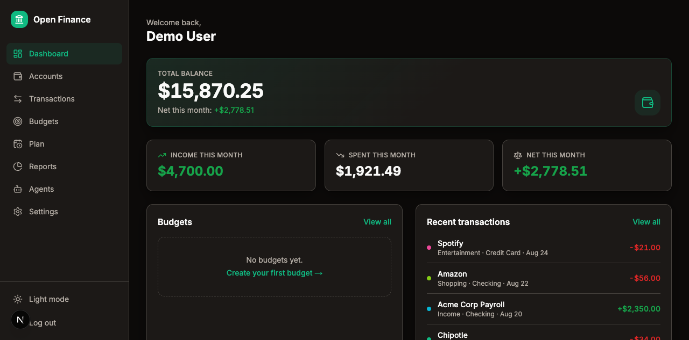
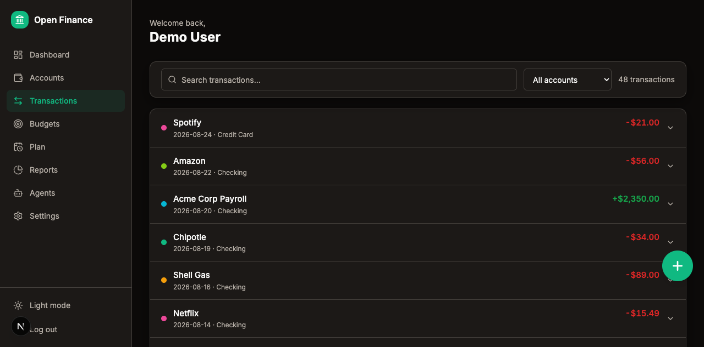
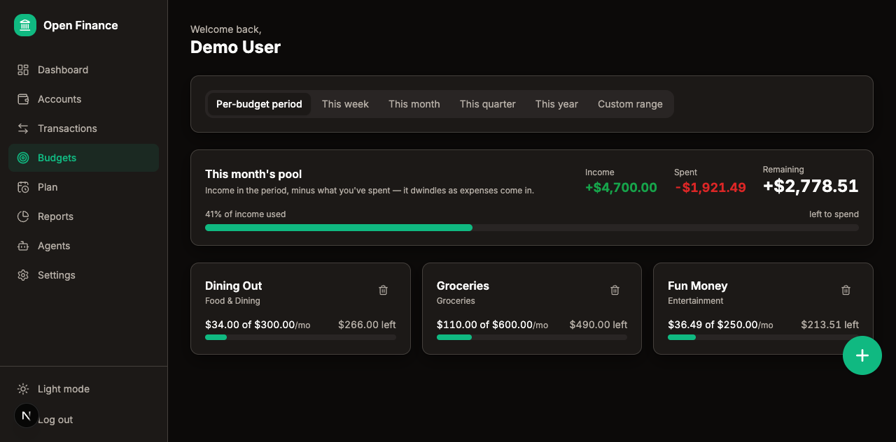
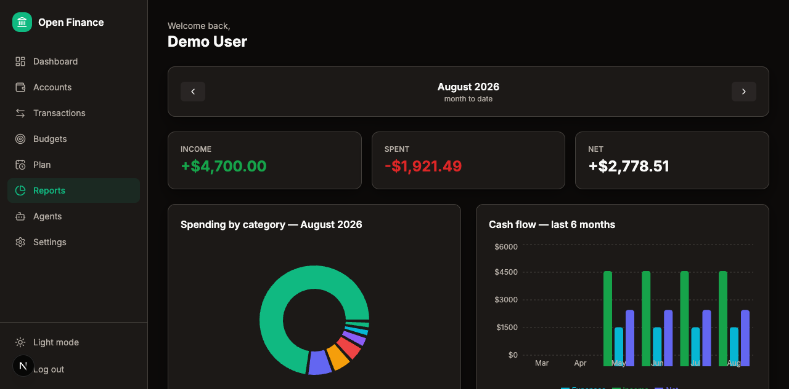
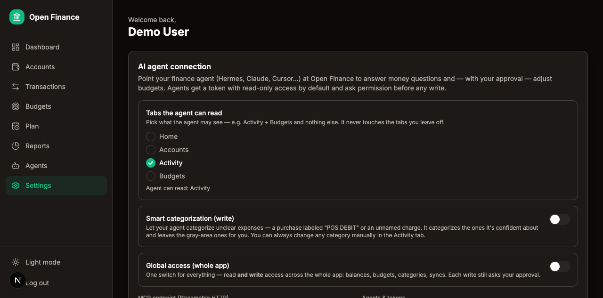
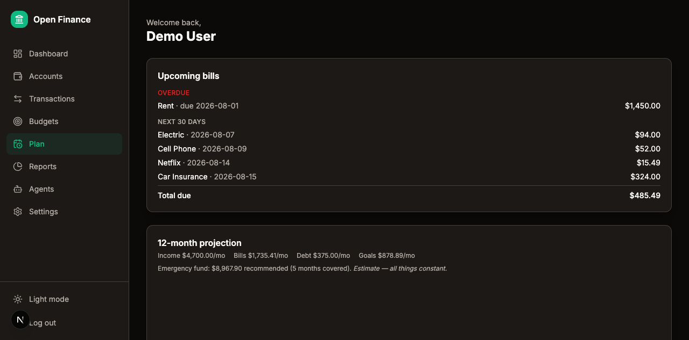

# Open Finance

**Self-hosted, open-source personal finance.** Your accounts, budgets, and
reports live in a SQLite file on *your* machine or phone — no cloud, no
middleman, no accounts with us.

- 🏠 **Runs anywhere** — your desktop, a home server, your Android phone, your iPhone
- 🔐 **You own your data** — SQLite + AES-256-GCM encryption at rest
- 🔑 **Bring your own Plaid keys** — or none at all (manual entry is first-class)
- 🤖 **Bring your own agent** — optional, read-only by default, asks permission before it looks anywhere



## Install (choose one)

### Option A — Desktop (macOS / Linux)

```bash
curl -fsSL https://raw.githubusercontent.com/DeseretSaint/open-finance/main/scripts/install.sh | bash
```

Opens `http://localhost:3000`. Create your account, add Plaid keys or track manually.

### Option B — Android phone (standalone APK)

1. Download the latest **.apk** from the [Releases page](https://github.com/DeseretSaint/open-finance/releases).
2. Open the file on your phone and install it (allow "install unknown apps" for your browser).
3. Launch → create your account → set a PIN (or enable biometrics).

The phone app runs **fully on-device**: your data lives in the phone's local
database. No server, no hub. You can pair it to your desktop hub later from
Settings → Hub & phone pairing.

### Option C — iPhone

Open Finance is a progressive web app, so it installs natively on iPhone:

1. In Safari, open your hub's URL (or the hosted instance) and **sign in**.
2. Tap **Share** → **Add to Home Screen**.
3. Launch it from your home screen — it runs full-screen like an app, with
   offline caching and push notifications.

Your iPhone talks to your hub over your network (LAN or Tailscale). All data
still lives on your hub — nothing is stored on Apple's servers.

### Option D — Home server / Docker

```bash
docker compose up
```

Runs non-root with a healthcheck, SQLite on a volume, env-only secrets.
Then pair phones from Settings → Hub & phone pairing (LAN IP or Tailscale).

## Features

- **Accounts & activity** — link banks via Plaid (bring your own free keys)
  or add accounts manually. Expenses are red/negative, income green/positive.
- **Budgets** — weekly, monthly, or yearly per category, with custom date ranges.
- **Reports** — spending by category, cashflow, net worth, and a 12-month projection.
- **Planning** — bills, debts, savings and investment goals.
- **AI agent** — connect any MCP-capable agent (Hermes, Claude, Cursor, custom
  scripts). Read-only by default; you choose exactly which tabs it can read,
  whether it can auto-categorize, and whether it gets global access. Every
  write asks your approval. See [docs/AGENTS.md](docs/AGENTS.md).
- **Security** — device PIN + biometric unlock, encrypted at rest, recovery
  code for PIN resets, full audit log for agent actions.

## Screenshots

| | |
|---|---|
|  |  |
|  |  |
|  |  |

## Do I need my own Plaid keys?

For real bank connections, yes — they're **free** (Plaid's Sandbox or Trial
plan). Without them you can still use the whole app with manual entry.

## Do I need an AI agent?

No. Everything works without one. The agent is an optional extra.

## Development

```bash
pnpm install
pnpm typecheck && pnpm lint && pnpm test
pnpm build
```

See [docs/PLAN.md](docs/PLAN.md) for architecture and [docs/DESIGN.md](docs/DESIGN.md) for design tokens.

## License

[MIT](LICENSE)
